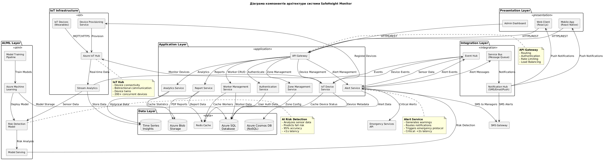

# Курсова робота з дисципліни "Системна інженерія програмного забезпечення"

**Тема:** Веб-додаток моніторингу будівельних майданчиків з AI для запобігання падінням з висоти

**Варіант:** 7

**Студент:** Постановський Ігор
**Група:** ІПЗм(д)-25
**Викладач:** Соловей О.В.

---

## Структура курсової роботи

Курсова робота складається з наступних компонентів:

### 1. Титульний лист
📄 **Файл:** `00_Титульний_лист.md`

### 2. Зміст
📄 **Файл:** `01_Зміст.md`

### 3. РОЗДІЛ 1: ТЕХНІЧНЕ ЗАВДАННЯ

Використовуються матеріали з **Лабораторної роботи №1**

**Джерело:** `../Лабораторна_робота_1/0-BusinessGoalAnalysis/`

**Включає:**
- **1.1. Опис проблеми**
  - Файл: `../Лабораторна_робота_1/0-BusinessGoalAnalysis/04_ProjectConcept/concept_document.md`
  - Опис проблеми падіння з висоти на будівельних майданчиках
  - Обґрунтування необхідності автоматизації

- **1.2. Діаграма бізнес-цілей**
  - Файл: `../Лабораторна_робота_1/0-BusinessGoalAnalysis/03_BusinessGoalDiagram/business_goals_diagram.png`
  - PlantUML: `../Лабораторна_робота_1/0-BusinessGoalAnalysis/03_BusinessGoalDiagram/business_goals_diagram.puml`
  - Опис: `../Лабораторна_робота_1/0-BusinessGoalAnalysis/03_BusinessGoalDiagram/README.md`

- **1.3. Положення про концепцію проекту**
  - Зацікавлені сторони: `../Лабораторна_робота_1/0-BusinessGoalAnalysis/01_StakeholderList/stakeholders.md`
  - RACI матриця: `../Лабораторна_робота_1/0-BusinessGoalAnalysis/02_StakeholderRACImatrix/raci_matrix.md`
  - Концепція проекту: `../Лабораторна_робота_1/0-BusinessGoalAnalysis/04_ProjectConcept/concept_document.md`

---

### 4. РОЗДІЛ 2: ПРОЕКТУВАННЯ ПРОГРАМНОГО ДОДАТКУ

**2.1. Діаграма варіантів використання**

Використовуються матеріали з **Лабораторної роботи №2**

**Джерело:** `../Лабораторна_робота_2/1-Requirements/`

- **UML діаграма:** `../Лабораторна_робота_2/1-Requirements/use_case_diagram.png`
- **PlantUML код:** `../Лабораторна_робота_2/1-Requirements/use_case_diagram.puml`
- **Опис Use Cases:** `../Лабораторна_робота_2/1-Requirements/use_cases_detailed.md`
  - 5 типів користувачів
  - 11 детальних варіантів використання

---

**2.2. Функціональні та нефункціональні вимоги**

**Створено для курсової роботи**

**Файл:** `02_Проектування/Таблиці_вимог.md`

**Базується на матеріалах з Лабораторної роботи №3:**
- Джерело FR: `../Лабораторна_робота_3/2-FuncNoFuncRequirements/2.1-FunctionalRequirements/README.md`
- Джерело NFR: `../Лабораторна_робота_3/2-FuncNoFuncRequirements/2.2-NonFunctionalRequirements/README.md`

**Зміст:**
- **Таблиця 1:** 12 груп функціональних вимог (58 підвимог)
- **Таблиця 2:** 14 груп нефункціональних вимог (67 підвимог)

---

**2.3. Концептуальний опис архітектури**

**Створено для курсової роботи**

**Файли:**
- `02_Проектування/component_diagram.puml` (PlantUML)
- `02_Проектування/component_diagram.png` (діаграма)

**Компоненти:**
- Presentation Layer
- Application Layer
- IoT Infrastructure
- AI/ML Layer
- Data Layer
- Integration Layer

---

**2.4. Макет зовнішнього вигляду вікон**

Використовуються матеріали з **Лабораторної роботи №5**

**Джерело:** `../Лабораторна_робота_5/4-UserInterface/`

**Wireframes (5 екранів):**
- `wireframes_01_login.png` - Екран автентифікації
- `wireframes_02_dashboard.png` - Головна панель моніторингу
- `wireframes_03_workers.png` - Управління працівниками
- `wireframes_04_zones.png` - Управління робочими зонами
- `wireframes_05_reports.png` - Звіти та аналітика

**Mockups (5 екранів):**
- `mockups_01_login.png` - Login Screen
- `mockups_02_dashboard.png` - Real-time Monitoring Dashboard
- `mockups_03_workers.png` - Worker Management Interface
- `mockups_04_zones.png` - Zone Configuration Panel
- `mockups_05_analytics.png` - Safety Analytics Dashboard

**Опис:** `../Лабораторна_робота_5/4-UserInterface/README.md`

---

**2.5. UML-діаграма концептуальних класів**

Використовуються матеріали з **Лабораторної роботи №6**

**Джерело:** `../Лабораторна_робота_6/2-Design/2.1-Design/`

**Діаграми:**
- `class_diagram_main.png` - Доменні сутності (11 Entity, 4 Value Objects, 7 Enums)
- `class_diagram_services.png` - Service Layer (7 Services, 6 Repositories)
- `class_diagram_controllers.png` - Presentation Layer (7 Controllers, DTOs, Middleware)

**Опис:**
- Документація: `../Лабораторна_робота_6/2-Design/2.1-Design/README.md`
- SOLID принципи: `../Лабораторна_робота_6/2-Design/2.1-Design/solid_principles.md`

**Архітектурні паттерни:**
- Repository Pattern
- Dependency Injection
- Data Transfer Objects (DTO)
- Strategy Pattern

---

**2.6. Словник атрибутів об'єктів**

**Створено для курсової роботи**

**Файл:** `02_Проектування/Словник_атрибутів.md`

**Таблиця 3:** Список атрибутів об'єктів
- 10 основних Entity таблиць
- 120+ атрибутів з повною специфікацією
- Типи даних, обмеження, зв'язки

---

**2.7. Схема таблиць бази даних**

**Створено для курсової роботи**

**Файли:**
- `02_Проектування/database_schema.puml` - ER-діаграма (PlantUML)
- `02_Проектування/Схема_БД_опис.md` - Детальний текстовий опис

**Зміст:**
- 10 основних таблиць
- Зв'язки між таблицями (1:N, N:1)
- Індекси та обмеження цілісності
- Партиціонування та оптимізація

---

### 5. РОЗДІЛ 3: РОЗРОБКА ПРОГРАМНОГО ДОДАТКУ

**Файл:** `03_Розробка/README.md`

**Зміст:**
- Технологічний стек
- Опис реалізації основних модулів
- **Посилання на відео-демонстрацію:** `https://www.youtube.com/watch?v=PLACEHOLDER_DEMO_VIDEO`
  _(буде додано після реалізації)_

---

### 6. РОЗДІЛ 4: МОДУЛЬНЕ ТЕСТУВАННЯ

**Файл:** `04_Тестування/README.md`

**Зміст:**
- Опис створених unit tests
- Покриття коду тестами
- **Посилання на відео-демонстрацію тестів:** `https://www.youtube.com/watch?v=PLACEHOLDER_TESTS_VIDEO`
  _(буде додано після створення тестів)_

---

## Вимоги до оформлення пояснювальної записки

Згідно з завданням на курсову роботу:

- **Шрифт:** Times New Roman
- **Розмір шрифту:** 14 пунктів
- **Міжрядковий інтервал:** 1,5
- **Формат:** A4, Книжна орієнтація
- **Поля:**
  - Верхнє: 20 мм
  - Нижнє: 20 мм
  - Ліве: 20 мм
  - Праве: 15 мм
- **Абзацний відступ:** 1,27 см (5 знаків)

---

## Інструкція з оформлення

### 1. Конвертація Markdown в Word

Використайте **Pandoc** для конвертації markdown файлів у Word:

```bash
pandoc input.md -o output.docx
```

Або онлайн сервіс: https://cloudconvert.com/md-to-docx

### 2. Збірка пояснювальної записки

**Порядок включення розділів:**

1. Титульний лист (`00_Титульний_лист.md`)
2. Зміст (`01_Зміст.md`)
3. Вступ (створити окремо)
4. Розділ 1 - використати матеріали з Лабораторної_робота_1
5. Розділ 2 - використати створені файли з `02_Проектування/` + матеріали з лабораторних
6. Розділ 3 - файл `03_Розробка/README.md`
7. Розділ 4 - файл `04_Тестування/README.md`
8. Висновки (створити окремо)
9. Список використаних джерел (створити окремо)
10. Додатки

### 3. Вставка діаграм та зображень

Всі діаграми (.png файли) вставляються з посиланням на рисунок:

```markdown

```

У Word документі:
- Під зображенням додати підпис: "Рисунок X.X - Назва"
- Вирівняти по центру
- Розмір зображення: не більше ширини текстового поля

---

## Стан виконання

| Розділ | Статус | Примітка |
|--------|--------|----------|
| Титульний лист | ✅ Готово | `00_Титульний_лист.md` |
| Зміст | ✅ Готово | `01_Зміст.md` |
| Розділ 1: Технічне завдання | ✅ Готово | Матеріали з Лаб.1 |
| Розділ 2: Проектування | ✅ Готово | Створено + матеріали з Лаб.2-6 |
| Розділ 3: Розробка | ⚠️ В процесі | Потрібна реалізація додатку |
| Розділ 4: Тестування | ⚠️ В процесі | Потрібні unit tests |
| Висновки | 📝 Не розпочато | Буде створено після розробки |
| Список джерел | 📝 Не розпочато | Буде створено при оформленні |

---

## Наступні кроки

1. ✅ Документація розділу "Проектування" - **ВИКОНАНО**
2. ⏭️ Реалізація програмного додатку (Розділ 3)
3. ⏭️ Створення unit tests (Розділ 4)
4. ⏭️ Запис відео-демонстрацій
5. ⏭️ Остаточне оформлення пояснювальної записки в Word

---

## Посилання

- **GitHub Repository:** https://github.com/HarrySkySon/systemna-inzheneria-labs
- **План виконання:** `ПЛАН_ВИКОНАННЯ.md`
- **Завдання на курсову:** `../Лабораторні Курсові_Завдання/Курсова_робота_2025.pdf`

---

**Дата останнього оновлення:** 16 грудня 2025
