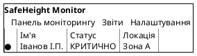

# Лабораторна робота №5

## Проектування інтерфейсу користувача (UI Design)

**Київський національний університет будівництва і архітектури**
**Кафедра:** Інформаційних технологій
**Дисципліна:** Системна інженерія програмного забезпечення

**Студент:** Постановський Ігор
**Група:** ІПЗм(д)-25
**Дата виконання:** 16 грудня 2025

---

## Мета роботи

Здобути навики проектування каркасу (wireframe) та макету (mockup) інтерфейсу користувача для програмного продукту.

---

## Проект

**Назва:** SafeHeight Monitor - Веб-додаток моніторингу будівельних майданчиків з AI для запобігання падінням з висоти

---

## Структура лабораторної роботи

### [4.1 Wireframes (Каркаси інтерфейсу)](./4.1-Wireframes/)

Структурна візуалізація інтерфейсу користувача з основними елементами та потоком взаємодії.

**Зміст:**
- 5 детальних wireframes для основних екранів
- Повне README з описом кожного wireframe
- Покриття 15+ Non-Functional Requirements
- PlantUML @salt синтаксис

**Список wireframes:**
1. **WF-01:** Екран автентифікації та входу (5 ролей, 3 методи автентифікації)
2. **WF-02:** Панель моніторингу в реальному часі (таблиця + карта)
3. **WF-03:** Екран попередження на IoT пристрої (критичні алерти)
4. **WF-04:** Керування робочими зонами (інтерактивна карта + бригада)
5. **WF-05:** Дашборд аналітики та звітності (KPI + графіки + рекомендації)

---

### [4.2 User Flow (Діаграма навігації)](./4.2-UserFlow/)

Візуалізація шляхів користувача через систему з точками прийняття рішень та переходами між екранами.

**Зміст:**
- Повна діаграма User Flow (Activity Diagram)
- Навігаційна карта (Navigation Map)
- Детальне README з описом всіх потоків

**Діаграми:**
1. **user_flow_diagram.puml** - Детальна діаграма з усіма потоками для 5 ролей
   - Процес автентифікації
   - Робочі процеси для кожної ролі
   - Точки прийняття рішень
   - Паралельні процеси
   - Автоматичні процеси

2. **navigation_map.puml** - Спрощена карта переходів між екранами
   - Всі основні та допоміжні екрани
   - Односторонні та двосторонні переходи
   - Модальні вікна та діалоги
   - Вкладки та підменю

**Користувацькі потоки:**
- Працівник: Автентифікація → IoT моніторинг → Реакція на алерти
- Інженер з ОП: Панель моніторингу → Фільтрація → Зв'язок → Звіти
- Бригадир: Керування зонами → Призначення → Моніторинг бригади
- Менеджер: Аналітика → Генерація звітів → Експорт → Рекомендації
- Адміністратор: Адмін панель → Всі модулі системи

---

### [4.3 Mockups (Детальні макети)](./4.3-Mockups/)

Точна візуалізація фінального дизайну з детальними кольорами, шрифтами, відступами та візуальною ієрархією.

**Зміст:**
- 4 детальні mockups з прив'язкою до NFR
- Повний Design System
- Детальне README з accessibility guidelines

**Список mockups:**
1. **NFR_1_1:** Екран автентифікації
   - Покриття: NFR1.1, NFR1.5, NFR6.1, NFR6.2
   - Кольорова палітра, typography, interactive states

2. **NFR_2_1:** Панель моніторингу в реальному часі
   - Покриття: NFR2.1, NFR2.2, NFR2.3, NFR3.1
   - Real-time features, visual hierarchy, performance metrics

3. **NFR_3_1:** Критичне попередження на IoT пристрої
   - Покриття: NFR3.1, NFR3.2, NFR3.3, NFR7.1, NFR7.2
   - Sensory alerts (sound, vibration, visual), accessibility для будівельників

4. **NFR_8_1:** Аналітика та звітність
   - Покриття: NFR8.1, NFR8.2, NFR8.3, NFR10.1, NFR10.2
   - Visual data representation, export features, AI recommendations

**Design System:**
- 20+ кольорів з HEX кодами (Primary, Semantic, Neutral)
- 13 типографських стилів (10px - 28px)
- 6 розмірів відступів (4px - 48px)
- 4 стани компонентів (default, hover, active, disabled)
- WCAG AA accessibility compliance
- 4 responsive breakpoints (Mobile, Tablet, Desktop, Large Desktop)

---

## Методологія

### Wireframes (Каркаси)

**Визначення:** Wireframe - це структурна, але приблизна візуалізація інтерфейсу, яка показує розміщення елементів, навігацію та потік взаємодії без детального візуального дизайну.

**Характеристики:**
- **Низька візуальна точність:** Прості форми, базові кольори (сірий, білий, акценти)
- **Висока функціональна точність:** Всі необхідні елементи інтерфейсу присутні
- **Фокус на структурі:** Розташування, розміри, пропорції елементів
- **Без фінальних кольорів:** Використовуються функціональні кольори (зелений=OK, червоний=помилка)
- **Без точних шрифтів:** Вказується лише ієрархія (великий/середній/малий)

**Мета:**
- Визначити структуру та компонування екранів
- Спроектувати потік користувацької взаємодії
- Узгодити розміщення елементів з командою
- Валідувати UX рішення до створення дизайну

**Інструменти:** PlantUML @salt, Balsamiq, Figma (low-fidelity mode), Sketch

---

### User Flow (Діаграма навігації)

**Визначення:** User Flow - це візуалізація шляху користувача через систему, яка показує послідовність екранів, точки прийняття рішень та можливі переходи.

**Елементи User Flow:**
- **Start/End** - початок та кінець потоку
- **Activity (дія)** - дія користувача або системи
- **Decision (рішення)** - точка вибору (if/else, switch)
- **Fork/Join** - паралельні процеси
- **Screen** - окремий екран інтерфейсу
- **Note** - додаткова інформація або коментарі

**Типи потоків:**
1. **Task Flow** - виконання конкретної задачі (наприклад, "Створити нову зону")
2. **User Flow** - повний шлях користувача через систему
3. **Wire Flow** - комбінація wireframes та user flow

**Мета:**
- Визначити всі можливі шляхи користувача
- Виявити точки прийняття рішень
- Оптимізувати навігацію між екранами
- Виявити мертві кінці та цикли
- Забезпечити логічність переходів

**Інструменти:** PlantUML (Activity/State Diagrams), Lucidchart, Miro, FigJam

---

### Mockups (Макети)

**Визначення:** Mockup - це точна, але статична візуалізація фінального дизайну інтерфейсу з детальними кольорами, шрифтами, відступами та візуальними ефектами.

**Характеристики:**
- **Висока візуальна точність:** Фінальні кольори, шрифти, іконки, зображення
- **Висока функціональна точність:** Всі елементи на своїх місцях
- **Точні відступи:** Padding, margins вказані в пікселях (8px, 16px, 24px)
- **Візуальні ефекти:** Тіні, градієнти, округлення кутів
- **Стани компонентів:** Default, hover, active, disabled, focus
- **Статичність:** Не інтерактивні (на відміну від prototype)

**Мета:**
- Затвердити фінальний візуальний дизайн
- Створити специфікації для розробників
- Сформувати UI Kit та Design System
- Забезпечити консистентність дизайну

**Інструменти:** PlantUML (з кольорами), Figma, Sketch, Adobe XD, Photoshop

---

## Еволюція дизайну: від Prototype до Interactive Prototype

| Етап | Рівень деталізації | Інтерактивність | Мета | Час створення |
|------|-------------------|-----------------|------|---------------|
| **Sketches** | Дуже низький | Ні | Швидке генерування ідей | Хвилини |
| **Wireframes** | Середній | Мінімальна | Структура та UX | Години |
| **Mockups** | Високий | Ні | Візуальний дизайн | Дні |
| **Prototype** | Високий | Так | Тестування взаємодії | Дні-тижні |
| **Final Product** | Повний | Повна | Робочий додаток | Місяці |

**Лабораторна робота №4:** Prototypes (горизонтальні) - базова візуалізація основних екранів
**Лабораторна робота №5:** Wireframes + Mockups - детальне проектування UX та UI

---

## Горизонтальний vs Вертикальний прототип

### Горизонтальний прототип (Lab 4)
**Характеристики:**
- **Широкий функціонал, мінімальна глибина**
- Показує багато екранів та функцій
- Не має робочої логіки backend
- Статичні або мінімально інтерактивні
- Дані хардкодені або симульовані

**Приклад:** 5 екранів системи SafeHeight Monitor з основними елементами UI

**Мета:** Показати замовнику повний спектр функціональності системи

---

### Вертикальний прототип
**Характеристики:**
- **Вузький функціонал, максимальна глибина**
- Показує один екран або feature детально
- Має робочу логіку backend
- Повністю функціональний
- Реальні дані з бази даних

**Приклад:** Один екран моніторингу з повною реалізацією:
- Підключення до реального IoT Hub
- Обробка даних через AI модель
- Відображення на карті в реальному часі
- Генерація та відправка алертів

**Мета:** Перевірити технічну реалізованість та продемонструвати core функціональність

---

## Зв'язок з попередніми лабораторними роботами

### Лабораторна робота №1: Аналіз бізнес-цілей
- Визначені стейкхолдери: Працівник, Інженер з ОП, Бригадир, Менеджер, Адміністратор
- Побудована діаграма бізнес-цілей
- Сформульована концепція проекту SafeHeight Monitor

↓

### Лабораторна робота №2: Use Cases
- Розроблено 11 детальних варіантів використання
- Створена діаграма Use Case
- Визначені основні функції для кожної ролі

↓

### Лабораторна робота №3: Функціональні та нефункціональні вимоги
- Сформульовані 58 функціональних вимог (FR)
- Розроблені 65 нефункціональних вимог (NFR)
- Забезпечена відстежуваність FR ← Use Cases

↓

### Лабораторна робота №4: Валідація вимог
- **User Stories** - трансформація FR у користувацькі історії (15 US, 9 Epics)
- **Acceptance Criteria** - критерії тестування на Gherkin (23 сценарії)
- **Traceability Matrix** - простежуваність FR → NFR → Epic → US → AC
- **Prototypes** - горизонтальні прототипи (5 екранів, PlantUML)

↓

### Лабораторна робота №5: Проектування UI
- **Wireframes** - структурна візуалізація інтерфейсу (5 екранів)
- **User Flow** - діаграми навігації користувача (5 ролей, 12+ екранів)
- **Mockups** - детальні макети з Design System (4 екрани, 20+ кольорів, 13 типографських стилів)

**Повний ланцюжок:**
```
Business Goals (Lab 1)
  → Use Cases (Lab 2)
  → Functional Requirements (Lab 3)
  → User Stories (Lab 4)
  → Wireframes (Lab 5)
  → Mockups (Lab 5)
  → [Майбутнє: Implementation]
```

---

## Висновки

У результаті виконання лабораторної роботи №5:

1. **Розроблено 5 детальних Wireframes** для основних екранів системи SafeHeight Monitor:
   - WF-01: Автентифікація (5 ролей, 3 методи)
   - WF-02: Моніторинг в реальному часі (таблиця + карта, автооновлення 5 сек)
   - WF-03: IoT попередження (критичні алерти з сенсорним фідбеком)
   - WF-04: Керування зонами (інтерактивна карта + бригада)
   - WF-05: Аналітика та звітність (8 KPI + графіки + AI рекомендації)

2. **Створено 2 діаграми User Flow** для візуалізації навігації:
   - Повна діаграма з усіма потоками для 5 ролей користувачів
   - Спрощена навігаційна карта з переходами між 12+ екранами
   - Детально описані 15+ точок прийняття рішень
   - Визначені паралельні та автоматичні процеси

3. **Розроблено 4 детальні Mockups** з прив'язкою до NFR:
   - NFR_1_1: Автентифікація (NFR1.1, NFR1.5, NFR6.1, NFR6.2)
   - NFR_2_1: Моніторинг (NFR2.1, NFR2.2, NFR2.3, NFR3.1)
   - NFR_3_1: IoT алерти (NFR3.1, NFR3.2, NFR3.3, NFR7.1, NFR7.2)
   - NFR_8_1: Аналітика (NFR8.1, NFR8.2, NFR8.3, NFR10.1, NFR10.2)

4. **Створено повний Design System:**
   - **Кольорова палітра:** 20+ кольорів з HEX кодами
     - Primary: #1976D2 (Blue 700)
     - Error: #D32F2F (Red 700)
     - Warning: #F57C00 (Orange 700)
     - Success: #2E7D32 (Green 700)
   - **Typography:** 13 стилів від 10px до 28px
   - **Spacing:** 6 токенів від 4px до 48px (8px grid)
   - **Component States:** Default, Hover, Active, Disabled, Focus

5. **Забезпечена Accessibility (WCAG AA):**
   - Контрастність кольорів: мінімум 4.5:1 для тексту
   - Touch targets: мінімум 44x44px (60x60px для рукавиць)
   - Keyboard navigation: всі елементи focusable
   - Screen reader support: ARIA labels, semantic HTML

6. **Застосовані сучасні практики UI/UX Design:**
   - Material Design principles
   - Mobile-first approach для IoT пристроїв
   - Responsive design (4 breakpoints)
   - Accessibility-first design
   - Data visualization best practices

7. **Покриття Non-Functional Requirements:**
   - Відображено метрики performance (NFR2.1, NFR2.2, NFR3.1)
   - Визначено UX метрики (NFR6.1 - SUS >80)
   - Показано accessibility features (NFR6.2 - WCAG AA)
   - Візуалізовано real-time features (автооновлення, затримки)

Розроблені артефакти дозволяють:
- Затвердити фінальний дизайн інтерфейсу з замовником
- Передати точні специфікації front-end розробникам
- Забезпечити консистентність дизайну через Design System
- Провести usability тестування перед розробкою
- Створити UI Kit для швидкої розробки компонентів

---

## Контрольні питання

### 1. Поясність основні відмінності між каркасом (wireframe) та макетом (mockup)?

**Wireframe (Каркас):**

**Визначення:** Структурна, але приблизна візуалізація інтерфейсу, яка показує розміщення елементів та потік взаємодії без детального візуального дизайну.

**Характеристики:**
- **Рівень деталізації:** Низький-середній
- **Кольори:** Базові (сірий, білий, чорний) + функціональні кольори для статусів (зелений=OK, червоний=помилка)
- **Шрифти:** Не визначені точно, лише ієрархія (великий/середній/малий заголовок)
- **Зображення:** Placeholder boxes з позначкою "X" або "Image"
- **Відступи:** Приблизні, візуальна пропорція
- **Інтерактивність:** Показана структурно (стрілки, описи)
- **Фокус:** Розташування елементів, структура, навігація, UX

**Мета:**
- Визначити структуру екранів
- Спроектувати потік користувацької взаємодії
- Узгодити розміщення елементів з командою
- Швидко ітерувати без витрат на деталізацію

**Приклад з Lab 5:**
WF-02 (Панель моніторингу) показує:
- Таблицю з працівниками (сірі рамки)
- Карту майданчику (просто прямокутник з позначеннями зон)
- Панель фільтрів (випадаючі списки)
- Статус-бар внизу
- Але НЕ показує точні кольори, розміри шрифтів, тіні

---

**Mockup (Макет):**

**Визначення:** Точна, статична візуалізація фінального дизайну з детальними кольорами, шрифтами, відступами та візуальними ефектами.

**Характеристики:**
- **Рівень деталізації:** Високий
- **Кольори:** Точна палітра з HEX кодами (#1976D2, #D32F2F, #2E7D32)
- **Шрифти:** Конкретні розміри (12px, 14px, 16px), вага (Regular, Bold)
- **Зображення:** Реальні або realistic placeholders
- **Відступи:** Точні значення (8px, 16px, 24px padding/margin)
- **Інтерактивність:** Показані різні стани (default, hover, active, disabled)
- **Фокус:** Візуальний дизайн, брендинг, UI consistency

**Мета:**
- Затвердити фінальний зовнішній вигляд
- Створити специфікації для front-end розробників
- Сформувати Design System та UI Kit
- Забезпечити візуальну консистентність

**Приклад з Lab 5:**
NFR_2_1 (Панель моніторингу) показує:
- Таблицю з точними кольорами (#FFEBEE для критичних рядків, #FFF3E0 для попереджень)
- Карту з конкретними кольорами зон (#E3F2FD для Зони A, #FFF9C4 для Зони B)
- Точні розміри шрифтів (Size 11 для статус-бару, Size 14 для заголовків)
- Тіні, rounded corners, hover effects
- HEX коди всіх кольорів в legend

---

**Порівняльна таблиця:**

| Характеристика | Wireframe | Mockup |
|----------------|-----------|---------|
| **Рівень деталізації** | Низький-середній | Високий |
| **Кольори** | Базові + функціональні | Точна палітра (HEX) |
| **Шрифти** | Ієрархія (L/M/S) | Точні розміри (12px, 14px) |
| **Зображення** | Placeholders | Реальні/realistic |
| **Відступи** | Приблизні | Точні (8px, 16px) |
| **Візуальні ефекти** | Відсутні | Тіні, градієнти |
| **Interactive states** | Не показані | Default, hover, active |
| **Час створення** | Години | Дні |
| **Мета** | UX проектування | UI дизайн |
| **Аудиторія** | Команда, замовник (UX) | Розробники, замовник (UI) |
| **Змінюваність** | Висока (легко міняти) | Середня (потребує редизайну) |

---

**Метафора:**
- **Wireframe** = Архітектурний креслення будинку (де розташовані кімнати, вікна, двері)
- **Mockup** = Фотореалістична візуалізація будинку (з кольорами стін, матеріалами, меблями)

---

### 2. Які засоби найбільш придатні для проектування каркасу (wireframe) та макету (mockup)?

### Інструменти для Wireframes

#### 1. **Balsamiq Wireframes**
**Тип:** Dedicated wireframing tool

**Переваги:**
- Sketch-стиль (виглядає як ручний малюнок) - зрозуміло, що це НЕ фінальний дизайн
- Дуже швидко створювати wireframes
- Готова бібліотека UI компонентів
- Легко змінювати та ітерувати

**Недоліки:**
- Платний ($9/місяць)
- Не підходить для high-fidelity дизайну
- Обмежені можливості кастомізації

**Коли використовувати:** Швидке прототипування структури, презентація замовнику на ранніх етапах

---

#### 2. **PlantUML (@salt syntax)**
**Тип:** Text-based diagramming tool (використаний у цій роботі)

**Переваги:**
- Текстовий формат - легко зберігати у Git, версіонування
- Швидке створення через код
- Автоматична генерація зображень
- Безкоштовний та open-source
- Інтеграція з VS Code, IntelliJ

**Недоліки:**
- Обмежені візуальні можливості
- Не інтуїтивний для non-programmers
- Складно робити складні layouts

**Коли використовувати:** Документація в Git, технічні проекти, коли потрібна версіонованість

**Приклад (з Lab 5):**


---

#### 3. **Figma (Low-fidelity mode)**
**Тип:** UI/UX design platform

**Переваги:**
- Веб-based - працює в браузері, не потрібно встановлювати
- Безкоштовний для індивідуального використання
- Співпраця в реальному часі (як Google Docs)
- Можна швидко створювати wireframes через Auto Layout
- Легко перейти від wireframes до mockups у тому самому файлі

**Недоліки:**
- Може бути надмірним для простих wireframes
- Крива навчання вища ніж у Balsamiq

**Коли використовувати:** Коли планується робити і wireframes, і mockups в одному інструменті, командна робота

---

#### 4. **Sketch**
**Тип:** UI/UX design tool (macOS only)

**Переваги:**
- Спеціалізований інструмент для дизайну інтерфейсів
- Великі бібліотеки готових UI kits
- Потужні символи та стилі для consistency

**Недоліки:**
- Тільки для macOS
- Платний ($99 одноразово)
- Відсутня веб-версія

**Коли використовувати:** macOS середовище, професійний UI/UX дизайн

---

#### 5. **Excalidraw / Miro / Lucidchart**
**Тип:** Collaborative whiteboard tools

**Переваги:**
- Дуже швидке створення схематичних wireframes
- Чудово для brainstorming сесій
- Collaborative real-time editing

**Недоліки:**
- Низька точність
- Не підходить для детальних wireframes
- Більше для sketches, ніж wireframes

**Коли використовувати:** Ранні етапи, brainstorming, віддалена співпраця

---

### Інструменти для Mockups

#### 1. **Figma** ⭐ (Рекомендовано)
**Переваги:**
- Industry standard для UI/UX дизайну
- Веб-based - працює скрізь
- Design Systems: Colors, Typography, Components
- Auto Layout для responsive design
- Prototyping можливості (анімації, переходи)
- Plugins для ікок, зображень, accessibility checkers
- Безкоштовний для індивідуального використання

**Недоліки:**
- Потребує інтернет з'єднання для повного функціоналу
- Може бути повільним на великих файлах

**Коли використовувати:** Професійні проекти, командна робота, створення Design System

---

#### 2. **Adobe XD**
**Переваги:**
- Інтеграція з Adobe Creative Cloud
- Потужні prototyping можливості
- Design specs для розробників (автоматичні CSS)
- Repeat Grid для швидкого створення lists

**Недоліки:**
- Платний (Adobe Creative Cloud)
- Менш популярний ніж Figma зараз

**Коли використовувати:** Якщо вже використовуєте Adobe екосистему

---

#### 3. **Sketch** (macOS only)
**Переваги:**
- Найстаріший та дуже зрілий інструмент
- Величезна кількість plugins та UI kits
- Symbol management для reusable components

**Недоліки:**
- Тільки macOS
- Платний
- Відсутня native collaboration

**Коли використовувати:** macOS середовище, existing Sketch workflows

---

#### 4. **PlantUML (з кольорами)**
**Тип:** Text-based (використаний у цій роботі для mockups)

**Переваги:**
- Текстовий формат - Git versioning
- Можна вказати точні кольори (<back:#1976D2>)
- Автоматична генерація
- Безкоштовний

**Недоліки:**
- Обмежені візуальні можливості (немає тіней, градієнтів)
- Не підходить для складних дизайнів
- Складно створювати pixel-perfect mockups

**Коли використовувати:** Документація, технічні проекти, коли потрібен version control

**Приклад (з NFR_2_1):**
```plantuml
<back:#D32F2F><color:white><b> КРИТИЧНО </b></color></back>
<back:#FFEBEE>фон критичного рядка</back>
<color:#1976D2>Primary color text</color>
```

---

#### 5. **Adobe Photoshop / Illustrator**
**Переваги:**
- Потужні графічні можливості
- Повний контроль над кожним піксел

**Недоліки:**
- Призначені для графічного дизайну, не UI
- Немає prototyping можливостей
- Важко підтримувати consistency
- Платні

**Коли використовувати:** Кастомна графіка, ілюстрації для UI, але НЕ для самого UI дизайну

---

### Рекомендовані комбінації

**Для цієї лабораторної роботи (з Git versioning):**
- Wireframes: **PlantUML @salt**
- User Flow: **PlantUML Activity Diagrams**
- Mockups: **PlantUML** (з кольорами) або **Figma** → експорт в зображення

**Для професійних проектів:**
- Wireframes: **Figma** (Low-fidelity)
- User Flow: **FigJam** (Figma whiteboard) або **Lucidchart**
- Mockups: **Figma** (High-fidelity) → Design System → Handoff to developers

**Для швидкого прототипування:**
- Wireframes: **Balsamiq** або **Excalidraw**
- User Flow: **Miro** або **FigJam**
- Mockups: **Figma**

---

### 3. Перелічіть основні вимоги до дизайну інтерфейсу користувача, яким він повинен відповідати?

Дизайн інтерфейсу користувача повинен відповідати наступним вимогам:

---

### 1. Usability (Зручність використання)

#### 1.1 **Learnability (Легкість навчання)**
- Новий користувач повинен швидко зрозуміти, як користуватися системою
- Інтуїтивні елементи управління
- Чітка візуальна ієрархія
- Підказки та tooltips для складних функцій

**Метрики:**
- Час навчання нового користувача: <10 хвилин
- Кількість помилок при першому використанні: <3

**Приклад з SafeHeight Monitor:**
- WF-01: Чіткий вибір ролі з іконками та описами
- WF-03: Великі кнопки "Я в безпеці" / "Потрібна допомога" - зрозуміло навіть без інструкцій

---

#### 1.2 **Efficiency (Ефективність)**
- Досвідчені користувачі можуть швидко виконувати задачі
- Мінімум кліків для основних дій
- Швидкі клавіші (shortcuts)
- Bulk operations для повторюваних дій

**Метрики:**
- Кількість кліків для типової задачі: <5
- Час виконання типової операції: <30 секунд

**Приклад з SafeHeight Monitor:**
- WF-01: QR-код вхід займає <15 секунд (1 дія: навести камеру)
- WF-02: Автооновлення кожні 5 сек - не потрібно вручну оновлювати

---

#### 1.3 **Memorability (Запам'ятовуваність)**
- Користувач, який не користувався системою деякий час, може повернутися без повторного навчання
- Консистентний дизайн
- Стандартні паттерни взаємодії

**Метрики:**
- Час на повторне освоєння після місяця перерви: <5 хвилин

**Приклад з SafeHeight Monitor:**
- Консистентне розташування навігації вгорі (WF-02, WF-04, WF-05)
- Однакові кольори для статусів (червоний=критично, зелений=OK)

---

#### 1.4 **Error Prevention & Recovery (Запобігання помилкам та відновлення)**
- Система запобігає помилкам користувача
- Чіткі повідомлення про помилки
- Можливість скасувати дію (Undo)
- Підтвердження для небезпечних операцій

**Приклад з SafeHeight Monitor:**
- WF-04: Підтвердження перед видаленням зони
- Валідація форм в реальному часі
- Error messages з конкретними інструкціями, що робити

---

#### 1.5 **Satisfaction (Задоволення)**
- Користувач отримує позитивний досвід від використання
- Приємний візуальний дизайн
- Smooth animations
- Feedback на дії (success messages, loading indicators)

**Метрика:** SUS (System Usability Scale) >80 (NFR6.1)

---

### 2. Accessibility (Доступність)

#### 2.1 **WCAG AA Compliance**
- **Контрастність:** мінімум 4.5:1 для нормального тексту, 3:1 для великого
- **Розмір тексту:** мінімум 12px, можливість збільшення до 200%
- **Touch targets:** мінімум 44x44px (WCAG 2.1)

**Приклад з SafeHeight Monitor:**
- NFR_1_1: Білий на синьому (#FFFFFF на #1976D2): 4.52:1 ✓
- NFR_3_1: Великі кнопки 60x60px (для рукавиць будівельників)

---

#### 2.2 **Keyboard Navigation**
- Всі інтерактивні елементи доступні з клавіатури
- Логічний tab order
- Видимі focus indicators
- Skip links для швидкого доступу до основного вмісту

---

#### 2.3 **Screen Reader Support**
- Семантичний HTML (headings, lists, tables)
- ARIA labels для іконок та кнопок
- ARIA live regions для динамічного контенту (наприклад, алерти)
- Alt text для зображень

---

#### 2.4 **Color Independence**
- Інформація передається НЕ ТІЛЬКИ кольором
- Використання іконок + колір (● червоний + текст "Критично")

**Приклад з SafeHeight Monitor:**
- NFR_2_1: Критичний статус = червоний фон + червона крапка + текст "КРИТИЧНО"

---

### 3. Consistency (Консистентність)

#### 3.1 **Visual Consistency**
- Однакові кольори для однакових дій/статусів
- Консистентні шрифти та розміри
- Єдина сітка відступів (8px grid)

**Приклад з SafeHeight Monitor:**
- Зелений (#2E7D32) завжди означає "Безпечно / Успіх"
- Червоний (#D32F2F) завжди означає "Критично / Помилка"
- Primary button завжди синій (#1976D2)

---

#### 3.2 **Functional Consistency**
- Однакові дії виконуються однаково в різних частинах системи
- Стандартні паттерни взаємодії (наприклад, клік на рядок таблиці = деталі)

---

#### 3.3 **External Consistency**
- Відповідність платформним стандартам
- Використання знайомих паттернів (наприклад, бургер-меню, searchbar)

**Приклад:**
- iOS: кнопка "Назад" зліва вгорі
- Android: кнопка "Назад" системна
- Web: breadcrumbs для навігації

---

### 4. Visual Hierarchy (Візуальна ієрархія)

#### 4.1 **Size & Scale**
- Більші елементи = важливіші
- Заголовки (24px) > Текст (13px) > Captions (10px)

---

#### 4.2 **Color & Contrast**
- Акцентні кольори для важливих дій (Call-to-Action buttons)
- Приглушені кольори для вторинних елементів

**Приклад з SafeHeight Monitor:**
- Критичний алерт: Яскраво-червоний фон (#D32F2F) - неможливо пропустити
- Безпечний статус: Зелений текст (#2E7D32) - менш нав'язливий

---

#### 4.3 **Whitespace (Білий простір)**
- Достатні відступи між елементами
- Групування пов'язаних елементів

**Spacing system:** 4px, 8px, 16px, 24px, 32px, 48px

---

### 5. Responsiveness (Адаптивність)

#### 5.1 **Responsive Design**
- Коректне відображення на різних розмірах екранів
- Breakpoints: Mobile (320-599px), Tablet (600-1023px), Desktop (1024+)

---

#### 5.2 **Performance**
- Швидке завантаження (<3 секунди)
- Smooth animations (60 FPS)
- Lazy loading для зображень
- Оптимізація для низької швидкості інтернету

**NFR з SafeHeight Monitor:**
- NFR2.1: Автооновлення кожні 5 секунд
- NFR2.2: Затримка відображення статусу <3 секунди

---

### 6. Feedback (Зворотний зв'язок)

#### 6.1 **Immediate Feedback**
- Система миттєво реагує на дії користувача
- Hover effects на кнопках
- Active states при кліку
- Loading indicators при обробці

**Приклад:**
- Кнопка: Default → Hover (з тінню) → Active (темніший) → Disabled (сірий, 50% opacity)

---

#### 6.2 **Status Visibility**
- Користувач завжди знає, що відбувається
- Progress bars для довгих операцій
- Success/Error messages після дій

**Приклад з SafeHeight Monitor:**
- NFR_3_1: Після натискання "Я в безпеці" → Success message + логування події

---

### 7. Error Handling (Обробка помилок)

#### 7.1 **Clear Error Messages**
- Що пішло не так?
- Чому це сталося?
- Як це виправити?

**Поганий приклад:** "Error 500"
**Хороший приклад:** "Не вдалося зберегти зону. Перевірте підключення до інтернету та спробуйте ще раз."

---

#### 7.2 **Inline Validation**
- Перевірка даних в реальному часі
- Показувати помилки біля відповідного поля
- Червоний border + іконка помилки + текст помилки

---

### 8. Security & Privacy (Безпека та приватність)

#### 8.1 **Secure Authentication**
- Багатофакторна автентифікація
- Безпечне зберігання паролів (не показувати в UI)
- Session timeouts

**Приклад з SafeHeight Monitor:**
- WF-01: 3 методи автентифікації (QR-код, PIN, Логін/Пароль)
- Footer: "🔒 Безпечне з'єднання (SSL/TLS 1.3)"

---

#### 8.2 **Data Privacy**
- Не показувати конфіденційні дані без потреби
- Маскування персональних даних (***-**-1234)
- Підтвердження перед видаленням особистих даних

---

### 9. Internationalization (Інтернаціоналізація)

- Підтримка різних мов
- Right-to-Left (RTL) layouts для арабської, івриту
- Формати дат, чисел, валют залежно від локалі
- Unicode support для спеціальних символів

---

### 10. Mobile-Specific Requirements (для IoT/Mobile пристроїв)

#### 10.1 **Large Touch Targets**
- Мінімум 44x44px (WCAG)
- Для рукавиць: 60x60px (SafeHeight Monitor NFR_3_1)

---

#### 10.2 **Readable in Sunlight**
- Високий контраст
- Великі шрифти (мінімум 14px на мобільних)

---

#### 10.3 **Works Offline**
- Основний функціонал працює без інтернету
- Синхронізація при відновленні з'єднання

**Приклад:** Epic 9 (Lab 4) - Офлайн режим та синхронізація

---

### Підсумок вимог

| Категорія | Ключові метрики |
|-----------|----------------|
| **Usability** | SUS >80, час навчання <10 хв, <5 кліків на задачу |
| **Accessibility** | WCAG AA, контраст >4.5:1, touch targets >44px |
| **Performance** | Завантаження <3с, затримка UI <3с, 60 FPS |
| **Responsiveness** | 4 breakpoints, коректне відображення на всіх |
| **Visual Design** | Консистентна палітра, типографія, spacing grid |
| **Error Handling** | Зрозумілі повідомлення, inline validation |
| **Security** | SSL/TLS, MFA, session management |

---

### 4. Дайте визначення поняттям юзабіліті (usability) та доступність (accessibility) інтерфейсу користувача, наведіть приклади з вашої лабораторної роботи?

### Usability (Юзабіліті)

**Визначення (ISO 9241-11):**
Usability - це ступінь, до якого продукт може бути використаний конкретними користувачами для досягнення конкретних цілей з ефективністю, результативністю та задоволенням у вказаному контексті використання.

**Простими словами:** Наскільки легко, швидко та приємно користувачі можуть виконувати свої задачі в системі.

---

#### П'ять компонентів Usability (за Jakob Nielsen):

**1. Learnability (Легкість навчання)**
- Наскільки легко користувачі можуть виконати базові задачі при першому використанні?

**Приклад з Lab 5:**
- **WF-01 (Автентифікація):**
  - Вибір ролі з 5 опцій, кожна з іконкою та описом
  - Іконка 👷 "Працівник" + підказка "Швидкий доступ через QR-код або PIN"
  - Новий користувач відразу розуміє, яку роль обрати та як увійти

**2. Efficiency (Ефективність)**
- Наскільки швидко користувачі можуть виконувати задачі після освоєння інтерфейсу?

**Приклад з Lab 5:**
- **WF-01 (QR-код вхід):**
  - Одна дія: навести камеру на QR-код
  - Час автентифікації: <15 секунд (NFR1.1)
  - Порівняйте з традиційним вводом логіна/пароля (30-60 секунд)

- **WF-02 (Автооновлення):**
  - Дані оновлюються автоматично кожні 5 секунд
  - Інженеру з ОП НЕ потрібно вручну натискати "Оновити"
  - Економія: 200+ кліків на день

**3. Memorability (Запам'ятовуваність)**
- Наскільки легко користувачі можуть відновити навички після перерви?

**Приклад з Lab 5:**
- **Консистентність кольорів:**
  - Зелений (#2E7D32) завжди = "Безпечно / OK" (WF-02, WF-04, WF-05)
  - Червоний (#D32F2F) завжди = "Критично / Помилка"
  - Користувач, який не заходив місяць, відразу зрозуміє статуси за кольорами

**4. Error Prevention (Запобігання помилкам)**
- Скільки помилок роблять користувачі і наскільки вони серйозні?

**Приклад з Lab 5:**
- **WF-04 (Видалення зони):**
  - Перед видаленням зони - діалог підтвердження
  - "Ви впевнені, що хочете видалити Зону A? У ній зараз 3 працівники. Вони будуть переназначені."
  - Запобігає випадковому видаленню активних зон

- **NFR_3_1 (IoT Alert):**
  - Дві великі кнопки: "Я в безпеці" (зелена) vs "Потрібна допомога!" (червона)
  - Різні кольори запобігають плутанині
  - Кнопка "Допомога" має підтвердження (не активується випадково)

**5. Satisfaction (Задоволення)**
- Наскільки приємно використовувати інтерфейс?

**Метрика:** SUS (System Usability Scale) >80 (NFR6.1)

**Приклад з Lab 5:**
- **Візуальна ієрархія (NFR_2_1):**
  - Критичні рядки виділені червоним фоном (#FFEBEE)
  - Інженер з ОП миттєво бачить проблеми
  - Приємний Material Design стиль

- **Feedback на дії:**
  - Після натискання "Я в безпеці" → ✓ Success message
  - "Підтвердження отримано. Алерт знято. 10:45:35"
  - Користувач впевнений, що його дія спрацювала

---

#### Метрики Usability для SafeHeight Monitor:

| Метрика | Ціль | Реалізація (Lab 5) |
|---------|------|-------------------|
| SUS Score | >80 | Дизайн орієнтований на SUS >80 (NFR6.1) |
| Час навчання нового користувача | <10 хв | Інтуїтивні іконки, підказки (WF-01) |
| Кількість кліків для входу | <3 | QR-код: 2 кліки (відкрити камеру → сканувати) |
| Час виконання критичної задачі | <30 сек | Перегляд статусу працівника: 3 кліки, <10 сек |
| Помилки при першому використанні | <3 | Підтвердження для небезпечних дій (WF-04) |

---

### Accessibility (Доступність)

**Визначення (WCAG):**
Accessibility - це практика створення продуктів, які можуть використовувати люди з різними фізичними та когнітивними здібностями, включаючи людей з обмеженими можливостями.

**Простими словами:** Інтерфейс, який доступний для ВСІХ користувачів, незалежно від їх здібностей (зір, слух, моторика, когнітивні функції).

---

#### WCAG 2.1 - Чотири принципи (POUR):

**1. Perceivable (Сприйнятливість)**
- Інформація та UI компоненти повинні бути представлені так, щоб користувачі могли їх сприймати

**Приклади з Lab 5:**

**(1.1) Контрастність кольорів (WCAG AA):**
```
NFR_1_1 (Mockup):
- Білий на синьому (#FFFFFF на #1976D2): 4.52:1 ✓ (мінімум 4.5:1)
- Білий на червоному (#FFFFFF на #D32F2F): 5.17:1 ✓
- Білий на зеленому (#FFFFFF на #2E7D32): 4.89:1 ✓
```

**(1.2) Альтернативи для кольору:**
- NFR_2_1: Критичний статус = червоний фон + червона крапка ● + текст "КРИТИЧНО"
- НЕ ТІЛЬКИ колір, але і текст + іконка
- Людина з дальтонізмом зможе зрозуміти статус за текстом

**(1.3) Розмір шрифту:**
- Мінімальний розмір: 12px (Caption)
- Основний текст: 13-14px
- Заголовки: 16-24px
- Можливість збільшення до 200% без втрати функціональності

---

**2. Operable (Керованість)**
- UI компоненти та навігація повинні бути доступними для взаємодії

**Приклади з Lab 5:**

**(2.1) Touch Targets (Розмір тач-цілей):**
```
NFR_1_1:
- Стандартні кнопки: 44x44px (WCAG 2.1 AA)
- Primary button "Увійти": 48x48px

NFR_3_1 (IoT для будівельників з рукавицями):
- Кнопки "Я в безпеці" / "Потрібна допомога": 60x60px ✓
- Легко натиснути навіть у товстих робочих рукавицях
```

**(2.2) Keyboard Navigation:**
- Всі інтерактивні елементи доступні з клавіатури
- Tab order: логічний (зверху вниз, зліва направо)
- Focus indicators: 2px синій outline (#1976D2), 2px offset
- Skip links: "Перейти до основного вмісту" (для screen readers)

**Приклад:**
```
WF-02: Tab order при навігації клавіатурою:
1. [Оновити] button
2. [Пошук] input
3. [Статус] dropdown
4. [Зона] dropdown
5. Перший рядок таблиці [Деталі]
6. [Зв'язок] button
...
```

**(2.3) Час на реакцію:**
- Немає жорстких timeouts для критичних дій
- NFR_3_1: Попередження не зникає, поки користувач не відреагує
- Немає автоматичного перенаправлення без попередження

---

**3. Understandable (Зрозумілість)**
- Інформація та інтерфейс повинні бути зрозумілими

**Приклади з Lab 5:**

**(3.1) Зрозумілі повідомлення про помилки:**

Поганий приклад: "Error 403"

Хороший приклад (WF-01):
```
❌ Помилка входу
Не вдалося ідентифікувати QR-код.

Можливі причини:
• QR-код пошкоджений або застарілий
• Камера не має доступу до QR-коду

Спробуйте:
1. Очистіть об'єктив камери
2. Підійдіть ближче до QR-коду
3. Переконайтесь, що освітлення достатнє
4. Або увійдіть через PIN-код
```

**(3.2) Консистентна термінологія:**
- "Зона" завжди називається "Зона" (не "Область", "Сектор", "Ділянка")
- "Працівник" завжди "Працівник" (не "Робітник", "Співробітник")

**(3.3) Передбачуваність:**
- Кнопка "Назад" завжди у лівому верхньому куті
- Primary action (синя кнопка) завжди справа
- Secondary action (сіра кнопка) завжди зліва

---

**4. Robust (Надійність)**
- Контент повинен бути інтерпретований різними user agents, включаючи assistive technologies

**Приклади з Lab 5:**

**(4.1) Semantic HTML:**
```html
<!-- Правильно -->
<h1>Аналітика та звітність з безпеки</h1>
<h2>Ключові показники</h2>
<table>
  <thead>
    <tr><th>Ім'я</th><th>Статус</th></tr>
  </thead>
  <tbody>...</tbody>
</table>

<!-- Неправильно -->
<div class="title">Аналітика...</div>
<div class="big-text">Ключові показники</div>
<div class="table-thing">...</div>
```

**(4.2) ARIA Labels для іконок:**
```html
<!-- WF-02: Кнопка оновлення -->
<button aria-label="Оновити дані моніторингу">
  🔄 Оновити
</button>

<!-- NFR_3_1: Кнопка допомоги -->
<button
  aria-label="Активувати аварійний протокол та виклик допомоги"
  aria-describedby="help-button-description">
  ! ПОТРІБНА ДОПОМОГА!
</button>
<div id="help-button-description" hidden>
  Натисніть цю кнопку, якщо вам потрібна негайна допомога.
  Буде відправлено сповіщення інженеру з охорони праці, бригадиру та диспетчерській.
</div>
```

**(4.3) ARIA Live Regions для динамічного контенту:**
```html
<!-- WF-02: Статус-бар з автооновленням -->
<div aria-live="polite" aria-atomic="true">
  Останнє оновлення: <strong>10:45:32</strong>
  <span class="visually-hidden">Дані оновлені. Критичних алертів: 1</span>
</div>

<!-- NFR_3_1: Критичний алерт -->
<div role="alert" aria-live="assertive">
  ⚠ КРИТИЧНО! ВИЯВЛЕНО РИЗИК ПАДІННЯ З ВИСОТИ
</div>
```

---

#### Accessibility Features в SafeHeight Monitor (Lab 5):

| Feature | Реалізація | WCAG Рівень |
|---------|-----------|-------------|
| **Контрастність** | Мінімум 4.5:1 (NFR_1_1, NFR_2_1, NFR_3_1) | AA ✓ |
| **Touch Targets** | 44px (standard), 60px (рукавиці, NFR_3_1) | AA ✓, AAA ✓ |
| **Keyboard Navigation** | Всі елементи focusable, visible focus | AA ✓ |
| **Screen Readers** | ARIA labels, semantic HTML, live regions | AA ✓ |
| **Color Independence** | Іконка + колір + текст (NFR_2_1) | AA ✓ |
| **Readable Fonts** | Мінімум 12px, sans-serif | AA ✓ |
| **Error Identification** | Червоний border + іконка + текст | AA ✓ |

---

#### Спеціальні Accessibility Features для будівельників:

**NFR_3_1 (IoT Alert):**
1. **Sensory Redundancy (NFR3.3):**
   - 🔊 Звук: 90 dB (чутний через шум будівництва)
   - 📳 Вібрація: Максимальна інтенсивність (відчувається через рукавиці)
   - 🔴 Візуальний: Повноекранний червоний алерт (видно в яскравому сонячному світлі)
   - ⏱️ Потрійна надмірність → неможливо пропустити алерт

2. **Large Touch Targets:**
   - 60x60px кнопки (можна натиснути у товстих рукавицях)

3. **High Contrast:**
   - Читабельність при яскравому сонячному світлі
   - Білий текст на червоному фоні: контраст 5.17:1

4. **Simple Binary Choices:**
   - Лише 2 кнопки: "Безпечно" або "Допомога"
   - Немає складних меню або форм

---

### Порівняння Usability vs Accessibility:

| Аспект | Usability | Accessibility |
|--------|-----------|---------------|
| **Фокус** | Легкість використання для типових користувачів | Можливість використання для ВСІХ користувачів |
| **Метрики** | SUS, час виконання, кількість помилок | WCAG compliance, контраст, розмір targets |
| **Приклад (хороший Usability, погана Accessibility)** | Маленькі кнопки з іконками (швидко для досвідчених) | Маленькі кнопки недоступні для людей з поганим зором |
| **Приклад (хороша Accessibility, поганий Usability)** | Великі кнопки з детальними описами (доступно для всіх) | Забагато тексту, повільна взаємодія для досвідчених |
| **Ідеал** | **SafeHeight Monitor NFR_3_1:** Великі кнопки (Accessibility ✓) + зрозумілі мітки (Usability ✓) + сенсорний feedback (обидва ✓) | |

---

### Висновок:

**Usability:** Наскільки легко, швидко та приємно типовий користувач може виконувати задачі.

**Accessibility:** Чи може КОЖНА людина (незалежно від здібностей) використовувати систему.

**Найкращий UI:** Високий Usability + повна Accessibility

**Приклад з Lab 5:** NFR_3_1 (IoT Alert)
- ✓ Usability: Просте повідомлення, 2 великі кнопки, миттєвий фідбек
- ✓ Accessibility: Потрійний сенсорний feedback (звук + вібрація + візуальний), великі targets, високий контраст

---

### 5. Перелічіть основні правила для формування кольорової гами інтерфейсу користувача?

### Правила формування кольорової гами UI

#### 1. Використання Color Theory

**1.1 Базові кольорові схеми:**

**(A) Монохроматична (Monochromatic)**
- Один базовий колір + різні відтінки (tints, shades, tones)
- Переваги: Гармонійна, елегантна, консистентна
- Недоліки: Може бути нудною, мало контрасту

**Приклад:**
```
Базовий: Blue (#1976D2)
Lighter: #E3F2FD (Blue 50)
Light: #64B5F6 (Blue 300)
Dark: #1565C0 (Blue 800)
Darker: #0D47A1 (Blue 900)
```

**(B) Аналогова (Analogous)**
- Кольори, які розташовані поряд на колірному колі
- Переваги: Природна гармонія, приємна для ока
- Приклад: Синій + Блакитний + Зелений

**(C) Комплементарна (Complementary)**
- Протилежні кольори на колірному колі
- Переваги: Високий контраст, привертає увагу
- Приклад: Синій (#1976D2) + Помаранчевий (#F57C00)

**Використано в SafeHeight Monitor:**
```
Primary (Blue): #1976D2
Warning (Orange): #F57C00  ← Комплементарний до синього
```

**(D) Тріада (Triadic)**
- Три кольори, рівновіддалені на колірному колі
- Приклад: Червоний + Жовтий + Синій

---

**1.2 Правило 60-30-10**

- **60%** - Домінуючий колір (зазвичай нейтральний: білий, сірий)
- **30%** - Вторинний колір (підтримує домінуючий)
- **10%** - Акцентний колір (привертає увагу до важливих елементів)

**Приклад з SafeHeight Monitor:**
```
60% - Білий (#FFFFFF) + Світло-сірий (#F5F7FA) - фон сторінок
30% - Сірий (#ECEFF1, #FAFAFA) - картки, таблиці, панелі
10% - Синій (#1976D2) - кнопки, посилання, акценти
```

---

#### 2. Semantic Colors (Семантичні кольори)

**Принцип:** Кольори повинні мати зрозуміле значення і використовуватися консистентно.

**Стандартні семантичні кольори:**

| Значення | Колір | HEX (SafeHeight) | Використання |
|----------|-------|------------------|--------------|
| **Success / Safe** | Зелений | #2E7D32 | Успішні операції, безпечний статус |
| **Error / Danger** | Червоний | #D32F2F | Помилки, критичні стани |
| **Warning / Attention** | Помаранчевий/Жовтий | #F57C00 | Попередження, увага потрібна |
| **Info / Neutral** | Синій | #1976D2 | Інформаційні повідомлення |
| **Primary Action** | Синій | #1976D2 | Основні кнопки, посилання |
| **Secondary Action** | Сірий | #546E7A | Вторинні кнопки, cancel |

**Приклад з Lab 5 (NFR_2_1):**
```
Таблиця працівників:
- Безпечний статус (#2E7D32): "10%" ризик, зелений текст
- Попередження (#F57C00): "75%" ризик, помаранчевий фон рядка
- Критично (#D32F2F): "95%" ризик, червоний фон рядка
```

**Правило:** НЕ порушуйте встановлені асоціації
- ❌ НЕ використовуйте зелений для помилок
- ❌ НЕ використовуйте червоний для успіху
- ✓ Зелений завжди = OK, Червоний завжди = Проблема

---

#### 3. Accessibility - Контрастність кольорів

**WCAG 2.1 Стандарти:**

| Тип контенту | Рівень AA | Рівень AAA |
|--------------|-----------|-----------|
| Нормальний текст (<18px) | 4.5:1 | 7:1 |
| Великий текст (≥18px або ≥14px bold) | 3:1 | 4.5:1 |
| UI компоненти (кнопки, іконки) | 3:1 | - |

**Приклад з Lab 5 (NFR_1_1):**
```
Перевірені комбінації:
✓ Білий (#FFFFFF) на Синьому (#1976D2): 4.52:1 (AA для <18px)
✓ Білий (#FFFFFF) на Червоному (#D32F2F): 5.17:1 (AA)
✓ Білий (#FFFFFF) на Зеленому (#2E7D32): 4.89:1 (AA)
✓ Чорний (#000000) на Жовтому (#FFF9C4): 16.34:1 (AAA)
✓ Blue Gray 600 (#546E7A) на Білому: 5.91:1 (AA)
```

**Інструменти для перевірки:**
- WebAIM Contrast Checker: https://webaim.org/resources/contrastchecker/
- Figma Plugins: Stark, Contrast
- Chrome DevTools: Lighthouse Accessibility audit

**Правило:**
- Завжди перевіряйте контраст текст/фон перед фіналізацією
- Для критичної інформації прагніть до AAA (7:1)

---

#### 4. Color Palette Sizes (Розмір палітри)

**Рекомендація:** 5-7 основних кольорів + відтінки

**Структура палітри:**

1. **Primary Color** (1 колір)
   - Основний бренд-колір
   - Використання: Основні кнопки, посилання, акценти
   - SafeHeight: #1976D2 (Blue 700)

2. **Semantic Colors** (3-4 кольори)
   - Success, Error, Warning, Info
   - SafeHeight: #2E7D32 (зелений), #D32F2F (червоний), #F57C00 (помаранчевий)

3. **Neutral Colors** (3-5 відтінків сірого)
   - Фон, текст, borders
   - SafeHeight: #FFFFFF (white), #F5F7FA (bg), #ECEFF1, #546E7A (text secondary)

4. **Shades & Tints** (для кожного основного кольору)
   - Світліші та темніші версії
   - Material Design: 50, 100, 200, ... 900
   - SafeHeight Blue: 50 (#E3F2FD), 700 (#1976D2), 800 (#1565C0)

**Приклад палітри SafeHeight Monitor (Lab 5):**
```
Primary:
- #1976D2 (Blue 700) - основний
- #E3F2FD (Blue 50) - light backgrounds
- #1565C0 (Blue 800) - dark variant

Semantic:
- #D32F2F (Red 700) - error/critical
- #FFEBEE (Red 50) - error backgrounds
- #F57C00 (Orange 700) - warning
- #FFF3E0 (Orange 50) - warning backgrounds
- #2E7D32 (Green 700) - success/safe
- #E8F5E9 (Green 50) - success backgrounds

Neutral:
- #FFFFFF (White) - surface
- #F5F7FA - background
- #FAFAFA (Gray 50) - surface variant
- #ECEFF1 (Blue Gray 50) - disabled backgrounds
- #546E7A (Blue Gray 600) - text secondary
- #37474F (Blue Gray 800) - text primary (on dark)

Total: 20+ кольорів (але базових лише 5: Blue, Red, Orange, Green, Gray)
```

**Правило:** Більше кольорів ≠ краще
- Забагато кольорів → хаос, відсутність консистентності
- Оптимально: 5-7 базових + їх відтінки

---

#### 5. Психологія кольорів (Color Psychology)

**Культурні асоціації:**

| Колір | Західна культура | Використання в UI |
|-------|------------------|-------------------|
| **Червоний** | Небезпека, терміновість, пристрасть | Помилки, критичні алерти, видалення |
| **Зелений** | Успіх, природа, безпека | Підтвердження, безпечні стани, "Go" |
| **Синій** | Довіра, професіоналізм, спокій | Основний бренд, інформація, посилання |
| **Жовтий/Помаранчевий** | Увага, енергія, оптимізм | Попередження, важлива інформація |
| **Фіолетовий** | Розкіш, креативність, технології | Premium features, AI/advanced features |
| **Сірий** | Нейтральність, професіоналізм | Фон, вторинний текст, disabled states |
| **Чорний** | Елегантність, авторитет, сила | Текст, преміум дизайн |
| **Білий** | Чистота, простота, мінімалізм | Фон, негативний простір |

**Приклад з SafeHeight Monitor:**
```
Червоний (#D32F2F) - критичні алерти про падіння (життєва небезпека!)
Зелений (#2E7D32) - безпечний статус (все OK, працюйте спокійно)
Синій (#1976D2) - довіра (професійна система моніторингу)
Помаранчевий (#F57C00) - попередження (увага, але не критично)
```

**ВАЖЛИВО:** Кольорові асоціації різні в різних культурах
- Білий: Західна культура = чистота, Східна = жалоба
- Червоний: Західна = небезпека, Китай = удача
- Для міжнародних продуктів - тестування з локальними користувачами

---

#### 6. Background vs Foreground (Фон vs Передній план)

**Правило Light UI:**
- **Фон:** Світлі кольори (#FFFFFF, #F5F7FA)
- **Текст:** Темні кольори (#000000, #546E7A)
- **Акценти:** Яскраві кольори (#1976D2, #D32F2F)

**Правило Dark UI:**
- **Фон:** Темні кольори (#121212, #1E1E1E)
- **Текст:** Світлі кольори (#FFFFFF, #E0E0E0)
- **Акценти:** Яскраві, але не надто насичені (щоб не сліпити)

**Приклад з Lab 5 (Light UI - основний):**
```
WF-02 (Панель моніторингу):
- Background: #F5F7FA (дуже світло-сірий)
- Surface (таблиця): #FFFFFF (білий)
- Text Primary: #000000 (чорний, але зазвичай #212121)
- Text Secondary: #546E7A (Blue Gray 600)
- Primary Action: #1976D2 (яскравий синій)
```

---

#### 7. Hierarchy through Color (Ієрархія через колір)

**Принцип:** Використовуйте насиченість та яскравість для створення візуальної ієрархії.

**Ієрархія тексту:**
- **Primary Text:** High contrast (чорний #000000 або #212121 на білому)
  - 87% opacity для комфортного читання
- **Secondary Text:** Medium contrast (#546E7A на білому)
  - 60% opacity
- **Disabled Text:** Low contrast (#9E9E9E)
  - 38% opacity

**Приклад з NFR_2_1:**
```
Таблиця працівників:
- Заголовки колонок: #000000, 12px, Bold (найвищий пріоритет)
- Ім'я працівника: #000000, 13px, Regular (високий пріоритет)
- ID працівника: #546E7A, 11px, Regular (середній пріоритет)
- Час оновлення: #78909C, 10px, Regular (низький пріоритет)
```

**Ієрархія дій (кнопки):**
- **Primary Action:** Яскравий колір (#1976D2), висока насиченість
- **Secondary Action:** Сірий (#ECEFF1), низька насиченість
- **Destructive Action:** Червоний (#D32F2F), висока насиченість

---

#### 8. Limit Palette Across App (Консистентна палітра)

**Правило:** Однакові кольори для однакових елементів у всій системі.

**Приклад:**
```
Primary Button в усіх екранах:
- WF-01 "Увійти в систему": #1976D2
- WF-02 "Оновити": #1976D2
- WF-04 "Створити нову зону": #1976D2
- WF-05 "Генерувати звіт": #1976D2
```

**Створення Design System (Lab 5):**
```css
/* Design Tokens */
--color-primary: #1976D2;
--color-error: #D32F2F;
--color-warning: #F57C00;
--color-success: #2E7D32;

--color-bg: #F5F7FA;
--color-surface: #FFFFFF;
--color-text-primary: #212121;
--color-text-secondary: #546E7A;

/* Usage */
.btn-primary {
  background: var(--color-primary);
  color: #FFFFFF;
}

.alert-critical {
  background: #FFEBEE; /* lighten(--color-error, 90%) */
  border-left: 4px solid var(--color-error);
}
```

---

#### 9. Test for Color Blindness (Перевірка на дальтонізм)

**Статистика:** ~8% чоловіків та ~0.5% жінок мають певну форму дальтонізму.

**Типи:**
- **Протанопія** (червоно-зелений дальтонізм) - найпоширеніший
- **Дейтеранопія** (зелений дальтонізм)
- **Тританопія** (синьо-жовтий дальтонізм)

**Правило:** НЕ покладайтесь ТІЛЬКИ на колір для передачі інформації.

**Приклад з Lab 5 (NFR_2_1):**
```
Статус працівника:
✗ Погано: Тільки колір рядка (зелений/помаранчевий/червоний)
✓ Добре:  Колір + іконка + текст

- Безпечно: <color:green>●</color> + зелений фон + текст "Безпечно"
- Увага:    <color:orange>●</color> + помаранчевий фон + текст "УВАГА"
- Критично: <color:red>●</color> + червоний фон + текст "КРИТИЧНО"

Людина з дальтонізмом зможе розрізнити за:
1. Іконкою (●)
2. Текстовою міткою
3. Різною інтенсивністю кольору (навіть якщо відтінок не розрізняється)
```

**Інструменти:**
- Chrome Extension: Colorblinding
- Figma Plugin: Color Blind
- Coblis - Color Blindness Simulator

---

#### 10. Cultural Considerations (Культурні особливості)

**Приклад:**
- **Червоний:**
  - Західна культура: Небезпека, стоп
  - Китай: Удача, святкування
  - Індія: Чистота

- **Білий:**
  - Західна: Чистота, мир
  - Східна (Китай, Японія): Траур, смерть

**Рекомендація для міжнародних продуктів:**
- Використовуйте універсальні семантичні кольори (зелений=OK, червоний=проблема працює майже скрізь)
- Тестуйте з користувачами з різних культур
- Не покладайтесь ТІЛЬКИ на колір - додавайте іконки та текст

---

### Підсумок правил:

1. **Color Theory:** Використовуйте монохроматичну або комплементарну схему
2. **60-30-10 Rule:** 60% домінуючий, 30% вторинний, 10% акцент
3. **Semantic Colors:** Зелений=успіх, Червоний=помилка, Помаранчевий=попередження (консистентно!)
4. **Accessibility:** Контраст мінімум 4.5:1 для тексту (WCAG AA)
5. **Palette Size:** 5-7 базових кольорів + відтінки (не більше!)
6. **Psychology:** Враховуйте культурні асоціації
7. **Light/Dark UI:** Правильний вибір фону та тексту
8. **Hierarchy:** Використовуйте насиченість для ієрархії
9. **Consistency:** Однакові кольори для однакових елементів
10. **Color Blindness:** Колір + іконка + текст (не тільки колір!)

**Приклад Design System з Lab 5:** 20+ кольорів, але базових лише 5 (Blue, Red, Orange, Green, Gray) + їх відтінки + консистентне використання = професійний, доступний, зрозумілий UI.

---

### 6. Назвіть і поясніть основні операції з візуальними елементами, які потрібно враховувати при проектуванні інтерфейсу користувача?

При проектуванні інтерфейсу користувача необхідно враховувати наступні операції з візуальними елементами:

---

### 1. Розміщення (Placement / Layout)

**Визначення:** Позиціонування елементів на екрані відносно один одного та меж екрану.

**Основні принципи:**

**(A) F-Pattern та Z-Pattern читання:**
- **F-Pattern:** Користувачі читають контент зверху вниз, зліва направо, формуючи букву "F"
  - Використовується для текстово-насичених сторінок (статті, списки)
  - Найважливіша інформація - зверху зліва

**Приклад з Lab 5 (WF-05 - Аналітика):**
```
┌─────────────────────────────────────┐
│ [Logo] Аналітика та звітність  ← F1│
├─────────────────────────────────────┤
│ Період: [Місяць] [Експорт PDF]  ← F2│
├─────────────────────────────────────┤
│ KPI1  KPI2  KPI3  KPI4          ← F3│
│ 247   198   49    8.2              │
│                                     │
│ Графік трендів                  ← F4│
│ [....................]              │
│                                     │
│ Таблиця топ зон                 ← F5│
└─────────────────────────────────────┘
```

- **Z-Pattern:** Око рухається від лівого верхнього кута → правий верхній → лівий нижній → правий нижній
  - Використовується для простих сторінок з мінімальним текстом (landing pages, login)

**Приклад з Lab 5 (WF-01 - Автентифікація):**
```
┌─────────────────────────────────────┐
│ [Logo] SafeHeight  --Z1-->  [Help] │
│                                     │
│           Вхід у систему        ← Z2│
│                                     │
│  [Вибір ролі - 5 опцій]            │
│  [QR-сканер]                        │
│                                     │
│    --Z3-->                          │
│                [Увійти в систему] Z4│
└─────────────────────────────────────┘
```

**(B) Grid System (Сіткова система):**
- **8px Grid:** Всі елементи вирівняні по сітці 8px
  - Відступи: 8px, 16px, 24px, 32px, 48px
  - Розміри: 24px, 32px, 40px, 48px

**Приклад:**
```css
.card {
  padding: 16px;        /* 2 * 8px */
  margin-bottom: 24px;  /* 3 * 8px */
  border-radius: 8px;   /* 1 * 8px */
}

.button {
  padding: 8px 16px;    /* vertical: 1*8, horizontal: 2*8 */
  height: 40px;         /* 5 * 8px */
}
```

**(C) Proximity (Близькість):**
- Пов'язані елементи розташовані близько один до одного
- Непов'язані елементи розділені більшим відступом

**Приклад з Lab 5 (NFR_2_1 - Таблиця):**
```
[Ім'я працівника]  [Статус]  [Зона]  [Поверх]  ← Близько (одна сутність)
↓ 16px відступ (розділення між працівниками)
[Ім'я працівника]  [Статус]  [Зона]  [Поверх]
```

**(D) Responsive Layout:**
- Адаптація розміщення під різні розміри екранів

**Breakpoints (Lab 5):**
```
Mobile (320-599px):   Stack elements vertically
Tablet (600-1023px):  2-column grid
Desktop (1024-1439px): 3-4 column grid
Large (1440px+):      Max-width container with margins
```

---

### 2. Групування (Grouping)

**Визначення:** Об'єднання пов'язаних елементів в логічні блоки для покращення розуміння структури.

**Методи групування:**

**(A) Whitespace (Білий простір):**
- Відступи між групами більші, ніж всередині групи
- Правило: Внутрішні відступи < Зовнішні відступи

**Приклад з Lab 5 (NFR_3_1 - IoT Alert):**
```
┌─────────────────────────────────┐
│ ⚠ КРИТИЧНО!                     │  ← Заголовок (isolated)
├─────────────────────────────────┤
│                                 │  ← 24px відступ
│ Виявлені загрози:               │  ← Група 1: Header
│   • Небезпечна висота: 12.5м    │
│   • Нестабільне положення: 45°  │
│   • Близько до краю: 0.5м       │  ← 8px між items
│                                 │  ← 24px відступ
│ Рекомендації з безпеки:         │  ← Група 2: Header
│   1. Зупиніться негайно         │
│   2. Відійдіть від краю         │
│   3. Підключіть трос            │  ← 8px між items
│                                 │  ← 24px відступ
│ [Я в безпеці]                   │  ← Група 3: Actions
│ [Потрібна допомога!]            │
└─────────────────────────────────┘

Внутрішні відступи (8px) < Між-групові відступи (24px) ✓
```

**(B) Borders & Dividers (Рамки та розділювачі):**
- Візуальне розділення груп

**Приклад:**
```
┌─────────────────────┐
│ Група 1: KPI        │
├─────────────────────┤  ← Divider
│ Група 2: Графік     │
├─────────────────────┤  ← Divider
│ Група 3: Таблиця    │
└─────────────────────┘
```

**(C) Background Color (Фоновий колір):**
- Різні фони для різних груп

**Приклад з Lab 5 (NFR_8_1):**
```
┌─────────────────────────────────────┐
│ <back:#FFFFFF>Група 1: Контроли     │  ← Білий фон
├─────────────────────────────────────┤
│ <back:#E3F2FD>Група 2: Конфігурація│  ← Синій light фон
├─────────────────────────────────────┤
│ <back:#FFFFFF>Група 3: Дані         │  ← Білий фон
├─────────────────────────────────────┤
│ <back:#FFF9C4>Група 4: Рекомендації │  ← Жовтий light фон
└─────────────────────────────────────┘
```

**(D) Cards (Картки):**
- Кожна група контенту в окремій картці з тінню

**Приклад:**
```css
.card {
  background: #FFFFFF;
  border-radius: 8px;
  padding: 16px;
  box-shadow: 0 2px 4px rgba(0,0,0,0.1);
  margin-bottom: 16px;
}
```

---

### 3. Вирівнювання (Alignment)

**Визначення:** Позиціонування елементів вздовж спільної лінії для створення візуального порядку.

**Типи вирівнювання:**

**(A) Left Alignment (По лівому краю):**
- Найприроднійше для мов, що читаються зліва направо
- Використовується для тексту, списків, форм

**Приклад з Lab 5 (WF-01):**
```
Вхід у систему              ← Заголовок (left)

☐ Працівник                ← Left aligned
☐ Інженер з ОП
☑ Бригадир
☐ Менеджер проекту

[QR-код сканування]        ← Left aligned
```

**(B) Center Alignment (По центру):**
- Використовується для заголовків, модальних вікон, одиночних елементів
- НЕ використовується для довгих текстів (погана читабельність)

**Приклад з Lab 5 (NFR_3_1 - Alert):**
```
       ⚠ КРИТИЧНО!          ← Centered

  ВИЯВЛЕНО РИЗИК ПАДІННЯ    ← Centered

    Ймовірність: 95%        ← Centered
```

**(C) Right Alignment (По правому краю):**
- Рідко використовується для основного контенту
- Використовується для чисел в таблицях, метаданих, timestamps

**Приклад з Lab 5 (NFR_2_1 - Таблиця):**
```
| Ім'я              | Ризик    |
|-------------------|----------|
| Іванов І.П.       |      95% |  ← Right aligned (числа)
| Петренко М.С.     |      75% |
| Сидоренко О.В.    |      10% |
```

**(D) Justified (По ширині):**
- Рідко використовується в UI (погана читабельність)
- Може створювати неоднакові відступи між словами

**(E) Baseline Alignment:**
- Вирівнювання тексту та іконок по базовій лінії

**Приклад:**
```
✓ Базове вирівнювання:
[🔍] Пошук    ← Іконка та текст на одній baseline

✗ Невірно:
[🔍]           ← Іконка вище
    Пошук     ← Текст нижче
```

---

### 4. Контраст (Contrast)

**Визначення:** Різниця між елементами для створення візуальної ієрархії та акцентів.

**Види контрасту:**

**(A) Color Contrast (Колірний контраст):**
- Використовується для привертання уваги, створення акцентів
- WCAG: Мінімум 4.5:1 для тексту

**Приклад з Lab 5:**
```
Primary Button:
- Background: #1976D2 (яскравий синій)
- Text: #FFFFFF (білий)
- Contrast: 4.52:1 ✓

Critical Alert:
- Background: #D32F2F (яскравий червоний)
- Text: #FFFFFF (білий)
- Contrast: 5.17:1 ✓ (високий контраст = помітно!)
```

**(B) Size Contrast (Контраст розміру):**
- Більші елементи = важливіші

**Приклад з Lab 5 (NFR_8_1 - KPI Cards):**
```
┌─────────────┐
│   247       │  ← 28px, Bold (дуже великий)
│ Попереджень │  ← 11px, Regular (маленький)
└─────────────┘

Контраст розміру: 28px / 11px = 2.5x
```

**(C) Font Weight Contrast (Контраст ваги шрифту):**
- Bold vs Regular

**Приклад:**
```
Заголовок: 16px Bold
Текст:     14px Regular

Contrast створює ієрархію
```

**(D) Whitespace Contrast:**
- Більше білого простору навколо елемента = більша важливість

**Приклад з Lab 5 (NFR_3_1):**
```
                                      ← 48px whitespace
    ⚠ КРИТИЧНО!                       ← Isolated with whitespace
                                      ← 48px whitespace

Виявлені загрози:                     ← 16px whitespace
  • Небезпечна висота
```

---

### 5. Повторення (Repetition)

**Визначення:** Консистентне використання одних і тих же візуальних елементів для створення єдності дизайну.

**Що повторювати:**

**(A) Кольори:**
```
Всі Primary Buttons в системі:
- WF-01: [Увійти в систему] → #1976D2
- WF-02: [Оновити] → #1976D2
- WF-04: [Створити зону] → #1976D2
- WF-05: [Генерувати звіт] → #1976D2

Консистентність = користувач знає, що це Primary Action
```

**(B) Шрифти:**
```
Design System (Lab 5):
- H1: 24px, Bold - для всіх заголовків сторінок
- H2: 18px, Bold - для всіх секцій
- Body: 13px, Regular - для всього основного тексту
- Caption: 10px, Regular - для всіх підписів
```

**(C) Spacing:**
```
Card padding: завжди 16px
Section spacing: завжди 24px
Button padding: завжди 8px vertical, 16px horizontal
```

**(D) Іконки:**
```
Всі статуси використовують одинакову іконку:
- Безпечно: <color:green>✓</color> (checkmark)
- Увага: <color:orange>!</color> (exclamation)
- Критично: <color:red>●</color> (filled circle)
```

**(E) Компоненти:**
```
Всі таблиці мають однаковий стиль:
- Header: #ECEFF1 background, Bold text
- Hover row: #F5F7FA background
- Border: 1px solid #ECEFF1
```

**Приклад повторення з Lab 5:**
```
WF-02, WF-04, WF-05 - всі мають:
1. Однакову верхню навігацію (синя #1976D2)
2. Однакову структуру: Header → Controls → Content → Footer
3. Однакові кнопки (синій Primary, сірий Secondary)
4. Однакові таблиці (стиль, шрифти, кольори)
```

---

### 6. Масштабування (Scaling / Sizing)

**Визначення:** Визначення розмірів елементів відповідно до їх важливості та функції.

**(A) Modular Scale (Модульна шкала):**
- Використання математичних пропорцій для розмірів

**Приклад (Type Scale з Lab 5):**
```
Base: 13px
Ratio: 1.2 (Major Third)

10px  (13 / 1.2 / 1.2) - Caption Small
11px  (13 / 1.2)       - Caption
13px  (base)           - Body
16px  (13 * 1.2)       - H4
18px  (13 * 1.2 * 1.2) - H3
20px  ...              - H2
24px  ...              - H1
28px  ...              - Display
```

**(B) Icon Sizing:**
```
Small icons:  16x16px (inline with text)
Medium icons: 24x24px (buttons, lists)
Large icons:  48x48px (features, empty states)
Hero icons:   64x64px+ (landing pages)
```

**(C) Touch Targets (для мобільних/IoT):**
```
WCAG 2.1 AA:  44x44px minimum
WCAG 2.1 AAA: 48x48px recommended
SafeHeight (рукавиці): 60x60px (NFR_3_1)
```

**(D) Responsive Sizing:**
```css
/* Desktop */
.card {
  padding: 24px;
  font-size: 14px;
}

/* Tablet */
@media (max-width: 1023px) {
  .card {
    padding: 16px;
    font-size: 13px;
  }
}

/* Mobile */
@media (max-width: 599px) {
  .card {
    padding: 12px;
    font-size: 12px;
  }
}
```

---

### 7. Приховування та показ (Show/Hide, Visibility)

**Визначення:** Керування видимістю елементів для спрощення інтерфейсу.

**(A) Progressive Disclosure (Поступове розкриття):**
- Показувати лише необхідну інформацію, ховати деталі за кліком

**Приклад з Lab 5 (WF-02 - Деталі працівника):**
```
Таблиця (компактний вигляд):
| Ім'я          | Статус   | Дії            |
| Іванов І.П.   | Критично | [Деталі]       | ← Collapsed

Після кліку [Деталі] → Modal з повною інформацією:
┌──────────────────────────────────────┐
│ Деталі працівника #0245              │
├──────────────────────────────────────┤
│ ПІБ: Іванов Іван Петрович            │  ← Expanded
│ Посада: Монтажник 5 розряду          │
│ Зона: A, Поверх: 3, Сектор: 12       │
│ Час роботи: 3 год 15 хв              │
│ Пульс: 125 уд/хв (підвищений)        │
│ Історія попереджень: 12 за місяць    │
│ ...                                  │
└──────────────────────────────────────┘
```

**(B) Accordions (Акордеони):**
```
▼ Група 1: Виявлені загрози          ← Expanded
  • Небезпечна висота: 12.5м
  • Нестабільне положення: 45°

▶ Група 2: Рекомендації              ← Collapsed
  (click to expand)

▶ Група 3: Біометричні дані          ← Collapsed
```

**(C) Tabs (Вкладки):**
- Показувати лише активну вкладку

**Приклад з Lab 5 (WF-02):**
```
[Панель моніторингу] [Звіти] [Налаштування] [IoT пристрої]
        ▲ Active

Видимий контент: лише "Панель моніторингу"
Інші вкладки: приховані (але доступні по кліку)
```

**(D) Responsive Hiding:**
```css
/* Hide on mobile */
@media (max-width: 599px) {
  .sidebar {
    display: none;
  }
  .hamburger-menu {
    display: block;
  }
}

/* Hide on desktop */
@media (min-width: 1024px) {
  .mobile-menu {
    display: none;
  }
}
```

---

### 8. Анімація та переходи (Animation & Transitions)

**Визначення:** Плавні зміни стану елементів для покращення UX.

**(A) Hover Effects:**
```css
.button {
  background: #1976D2;
  transition: all 0.2s ease;
}

.button:hover {
  background: #1565C0;  /* Darker */
  box-shadow: 0 4px 8px rgba(0,0,0,0.2);  /* Shadow */
  transform: translateY(-2px);  /* Slight lift */
}
```

**(B) Loading States:**
```
Before click:
[Генерувати звіт]

During processing (animated):
[⏳ Генерація звіту... 45%]

After completion:
[✓ Звіт готовий] (зелений, 2 сек) → [Генерувати звіт] (повернення)
```

**(C) Page Transitions:**
```
WF-01 (Login) → WF-02 (Dashboard):
- Fade out login screen (300ms)
- Fade in dashboard (300ms)
- Total transition: 600ms
```

**(D) Micro-interactions:**
```
Checkbox animation:
☐ (empty)
  ↓ 200ms (check appears)
☑ (checked)

Button ripple effect (Material Design):
[Click point] → Ripple expands → Fades out
```

**Правило:** Анімації повинні бути швидкими (150-300ms) і не заважати користувачу.

---

### Підсумок операцій:

| Операція | Мета | Приклад з Lab 5 |
|----------|------|-----------------|
| **Розміщення** | Визначити позицію елементів | F-pattern (WF-05), Z-pattern (WF-01), 8px grid |
| **Групування** | Об'єднати пов'язані елементи | Whitespace 24px між групами (NFR_3_1) |
| **Вирівнювання** | Створити візуальний порядок | Left-aligned forms, centered alerts |
| **Контраст** | Виділити важливе | 28px KPI numbers vs 11px labels (NFR_8_1) |
| **Повторення** | Забезпечити консистентність | Однаковий Primary button #1976D2 скрізь |
| **Масштабування** | Визначити розміри | Type scale 10-28px, touch targets 60px (NFR_3_1) |
| **Показ/Приховування** | Спростити інтерфейс | Progressive disclosure [Деталі] → Modal |
| **Анімація** | Покращити UX | Hover effects 200ms, page transitions 600ms |

**Ключовий принцип:** Всі операції працюють разом для створення зрозумілого, консистентного, приємного інтерфейсу, який допомагає користувачам ефективно досягати своїх цілей.

---

*Київський національний університет будівництва і архітектури, 2025*
